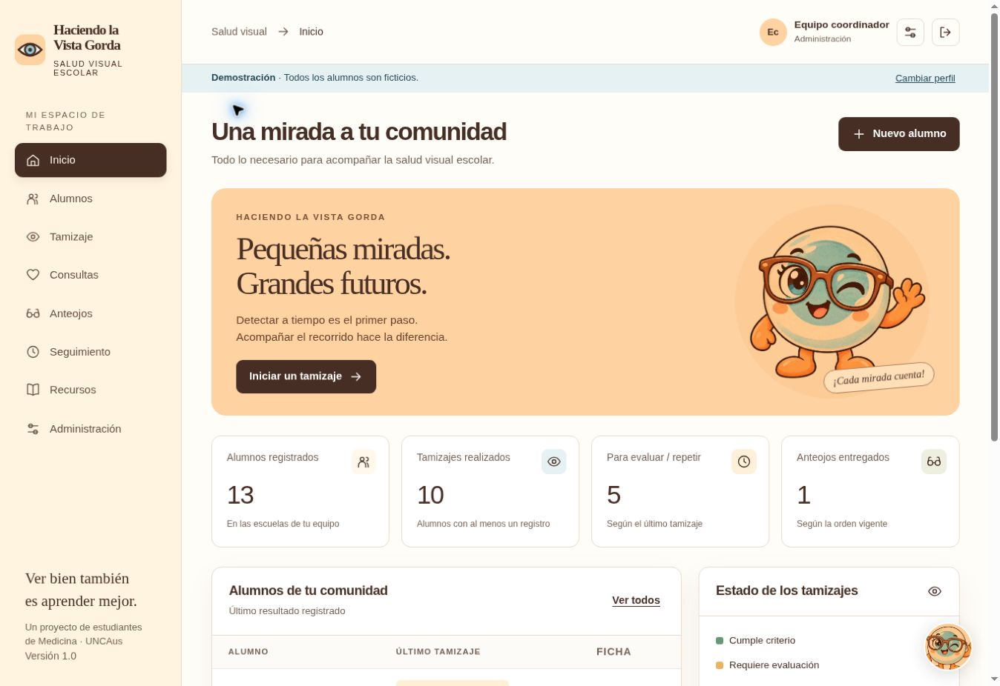

# Haciendo la Vista Gorda

**Salud visual escolar · versión 1.2.1**

Aplicación completa para registrar alumnos, guiar el registro de tamizajes con cartilla estandarizada, documentar consultas profesionales, gestionar anteojos y acompañar el seguimiento.

Paleta crema, durazno y celeste basada en la referencia del equipo. Incluye a **Lupi**, una mascota que ofrece ayuda contextual y una actividad de familiarización con direcciones.



## App Salud Visión dentro del ecosistema VinTracker

Usa el mismo proyecto Supabase que VinTracker y VinTracker Aventura, con sus registros en el esquema `hv`. Se publica como `app-salud-vision` dentro del mismo equipo Vercel. Incluye una página **Aplicaciones VinTracker** con enlaces a las otras dos apps. Los accesos y registros de salud siguen siendo propios; no se ha implementado inicio de sesión único ni intercambio de fichas.

## Publicar con Vercel y Supabase

Seguí [EMPEZAR_AQUI.md](EMPEZAR_AQUI.md). Incluye `vercel.json`, la función `api/index.js`, el esquema PostgreSQL de Supabase y **ABRIR_CONFIGURADOR.html**, un asistente local para preparar las variables sin escribir código ni compartir contraseñas.

La versión 1.2.1 conserva la demostración local con SQLite y utiliza PostgreSQL para el despliegue en Vercel. Supabase almacena los registros y Vercel ejecuta el servidor. No requiere Render para esta modalidad.

## Probar la app en tu computadora

1. Instalá **Node.js 24 LTS** desde [nodejs.org](https://nodejs.org/).
2. Extraé el ZIP y abrí una terminal dentro de esta carpeta (donde está `package.json`).
3. Ejecutá:

```bash
npm ci
npm run demo
```

4. Abrí **http://localhost:3000**.
5. Elegí uno de los cuatro perfiles de demostración. Todos los alumnos son ficticios.

**Ejecutá `npm ci` antes de las pruebas o del servidor PostgreSQL.** Instala las versiones exactas del archivo de dependencias. La demostración SQLite también puede iniciarse con `INICIAR_DEMO.bat` después de instalar Node 24.

El modo demo conserva los ensayos en una base separada dentro de `data/`. No ingreses datos reales en ese entorno. Cerrá con Ctrl+C.

## Qué incluye

- Panel de indicadores calculados desde los registros de la base.
- Alta y edición de datos escolares, búsqueda por nombre/DNI y filtros.
- Autorización documentada con fecha y referencia institucional.
- Tamizaje en cuatro pasos: alumno, preparación, resultados y revisión.
- Criterios por edad, observaciones, asimetría, alerta comunicada y no evaluable.
- Evaluación monocular y resultado binocular opcional únicamente si se midió.
- Consulta profesional con matrícula, diagnóstico, conducta, receta y derivación.
- Órdenes asociadas a la receta vigente: preparación y entrega con receptor.
- Seguimiento del uso de anteojos y atención de derivaciones.
- Historia de asientos, autoría, impresión de la ficha y exportación de totales por escuela.
- Cuatro roles, cuentas individuales, escuelas asignadas a docentes, sesiones revocables y auditoría.
- Cifrado del contenido personal y clínico en la base de datos.
- Diseño responsive, navegación por teclado, etiquetas, estados con texto y movimiento reducido.
- Pruebas automatizadas, Dockerfile y verificación en GitHub Actions.

## Subir directamente a GitHub

Creá un repositorio y subí **el contenido de esta carpeta**, no el ZIP cerrado. `package.json`, `README.md`, `public/` y `server/` deben quedar en la raíz del repositorio. La guía completa está en [EMPEZAR_AQUI.md](EMPEZAR_AQUI.md).

GitHub almacena el código. La configuración incluida publica la interfaz y la API en Vercel, y conserva los datos en Supabase. Las claves se cargan exclusivamente como variables del servidor. GitHub Pages no ejecuta esta API.

## Preparar una institución local (SQLite)

```bash
npm run setup
npm start
```

El asistente crea la clave de cifrado y la primera cuenta de administración; muestra la contraseña inicial una sola vez. No hay una contraseña administrativa fija en el código de producción.

Antes del registro real, la institución debe aprobar el protocolo clínico, el tratamiento de datos y el alojamiento. La opción `CLINICAL_ENABLED=false` mantiene bloqueada la carga de alumnos y registros asistenciales hasta su habilitación. La app no diagnostica a partir del tamizaje ni reemplaza una historia clínica institucional certificada.

## Comprobar el proyecto

```bash
npm ci
npm run check
npm test
```

El informe de comprobaciones está en [docs/VERIFICACION.md](docs/VERIFICACION.md). Para repetir pruebas de interfaz en tu equipo, instalá Playwright como dependencia de desarrollo opcional y consultá ese documento.

## Documentación

- [Propuesta general del proyecto (primera entrega)](docs/Propuesta_final_salud_visual.pdf)
- [Propuesta en formato editable Markdown](docs/PROPUESTA_FINAL.md)
- [Instalación, GitHub y puesta en línea](docs/INSTALACION.md)
- [Arquitectura, reglas y permisos](docs/ARQUITECTURA.md)
- [Verificación y simulacros](docs/VERIFICACION.md)
- [Operación y copias de seguridad](docs/OPERACION.md)

Este es un proyecto académico del equipo Haciendo la Vista Gorda. No se atribuye aprobación ni integración oficial con el programa federal. El contenido clínico debe ser revisado por el responsable sanitario antes del uso asistencial.
